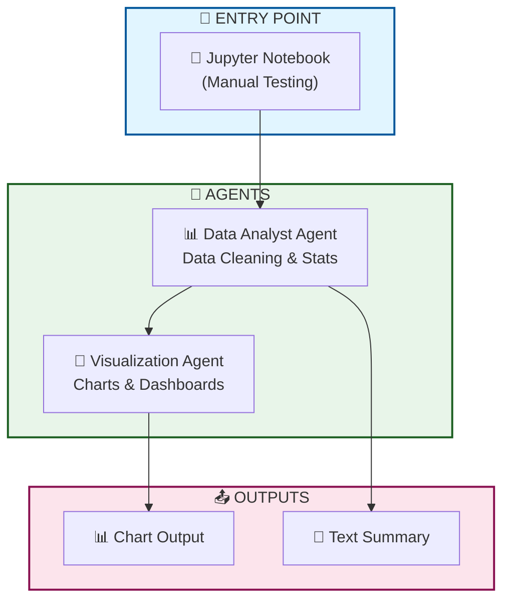
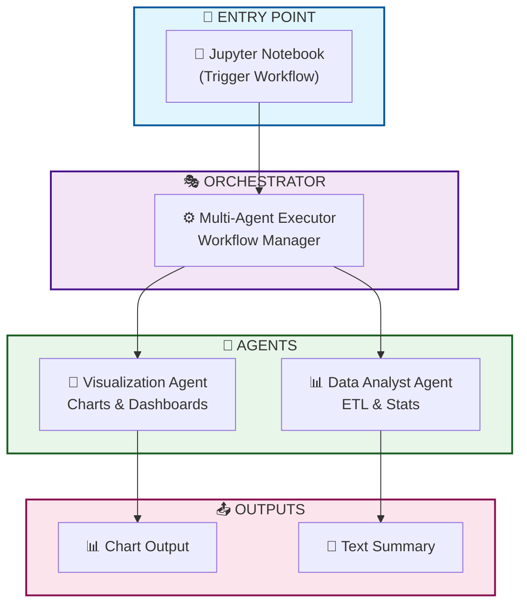
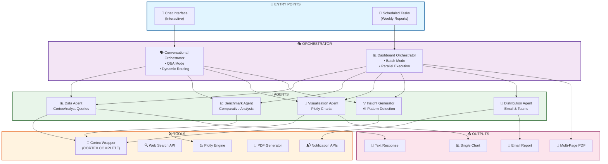

# Cortex Analytics Orchestrator

A multi-agent analytics orchestration platform that provides both interactive Q&A and automated dashboard generation. Built on Snowflake Cortex, it intelligently routes queries to specialized agents for data analysis, benchmarking, visualization, insight generation, and distribution.

**Key Features:**
- 🤖 Dual orchestration modes: Conversational (chat) and Dashboard (scheduled reports)
- 🎯 5 specialized agents for targeted analytics tasks
- 📊 Powered by Cortex Analyst (CORTEX.COMPLETE) for intelligent data querying
- 📈 Automated multi-chart PDF report generation
- 🔄 Parallel execution for efficient batch processing
Long Version (Full README description)
# Cortex Analytics Orchestrator

A production-ready multi-agent analytics platform designed for intelligent data exploration and automated reporting within Snowflake environments.

## Overview

Cortex Analytics Orchestrator provides two powerful entry points:
- **Interactive Chat Interface**: Dynamic Q&A with intelligent routing to specialized agents
- **Scheduled Tasks**: Automated weekly/periodic dashboard and report generation

## Architecture

The platform features a dual-orchestrator design:
🎨 Complete Visual Assets & Code Package
1. 📊 Visual Architecture Diagram
Mermaid Diagram (renders automatically on GitHub)
Add this to your README.md or create docs/architecture.md:

## Architecture Overview
- **STEP 1**:minimal (manual chaining).

- **STEP 2**: introduces the executor.

- **STEP 3**:full orchestration with multiple agents and tools.

### 1. Conversational Orchestrator
- Real-time query handling
- Dynamic agent routing based on user intent
- Single, focused responses for interactive exploration

### 2. Dashboard Generator Orchestrator
- Batch processing mode
- Parallel agent execution
- Comprehensive multi-chart outputs

### Specialized Agent Layer

Five domain-specific agents handle distinct analytics tasks:
1. **Data Agent** - Query and retrieve data using CortexAnalyst
2. **Benchmark Agent** - Comparative analysis and performance metrics
3. **Visualization Agent** - Chart generation with Plotly
4. **Insight Generator Agent** - AI-powered pattern detection and recommendations
5. **Distribution Agent** - Report delivery via email/Teams

## Technology Stack

- **Snowflake Cortex** (CORTEX.COMPLETE) - Core intelligence engine
- **CortexAnalyst Wrapper** - Natural language to SQL translation
- **Plotly** - Interactive visualizations
- **PDF Generation** - Multi-page report creation
- **Integration APIs** - Email, Teams notifications

## Use Cases

- Ad-hoc data exploration via natural language
- Automated weekly executive dashboards
- Benchmark analysis and competitive intelligence
- Self-service analytics for business users
- Scheduled report distribution to stakeholders

-------------------------------------------------Complete README.md Template-----------------------------------------------------------

# 🤖 Cortex Analytics Orchestrator

A production-ready multi-agent analytics orchestration platform that provides both interactive Q&A and automated dashboard generation. Built on Snowflake Cortex for intelligent data insights and automated reporting.

# Generate weekly report
report = orchestrator.generate_dashboard(
   metrics=["revenue", "customer_count", "conversion_rate"],
   time_period="last_week",
   output_format="pdf"
)
📊 Usage Examples
Example 1: Natural Language Query
# User asks a question
query = "Compare this month's sales to last month by region"

# Orchestrator routes to appropriate agents
response = orchestrator.process_query(query)

# Output includes:
# - Data from Data Agent
# - Comparative analysis from Benchmark Agent
# - Visualization from Visualization Agent
# - Key insights from Insight Generator
Example 2: Scheduled Dashboard
# Configure weekly executive dashboard
config = {
   "schedule": "weekly",
   "day": "monday",
   "time": "08:00",
   "metrics": [
       "revenue_trend",
       "customer_acquisition",
       "product_performance",
       "regional_comparison"
   ],
   "distribution": ["email", "teams"]
}

orchestrator.schedule_dashboard(config)
Example 3: Ad-hoc Deep Dive
# Multi-step analysis
queries = [
   "What's our churn rate this month?",
   "Which customer segments have highest churn?",
   "What are common characteristics of churned customers?"
]

insights = orchestrator.analyze_sequence(queries)
🛠️ Project Structure
cortex-analytics-orchestrator/
├── orchestrators/
│   ├── conversational.py       # Chat mode orchestrator
│   └── dashboard.py            # Batch mode orchestrator
├── agents/
│   ├── data_agent.py           # Query execution
│   ├── benchmark_agent.py      # Comparative analysis
│   ├── visualization_agent.py  # Chart generation
│   ├── insight_agent.py        # Pattern detection
│   └── distribution_agent.py   # Report delivery
├── tools/
│   ├── cortex_wrapper.py       # CortexAnalyst integration
│   ├── chart_generator.py      # Plotly utilities
│   ├── pdf_generator.py        # Report creation
│   └── notification.py         # Email/Teams APIs
├── config/
│   ├── agent_config.yaml       # Agent configurations
│   └── semantic_model.yaml     # CortexAnalyst semantic layer
├── tests/
│   ├── test_agents.py
│   └── test_orchestrators.py
├── docs/
│   ├── architecture-diagram.png
│   └── agent-design.md
├── examples/
│   ├── chat_example.py
│   └── dashboard_example.py
├── .env.example
├── .gitignore
├── requirements.txt
├── LICENSE
└── README.md
🔧 Configuration
Agent Configuration
Edit config/agent_config.yaml:

data_agent:
 model: "cortex-analyst"
 timeout: 30
 retry_attempts: 3

visualization_agent:
 default_chart_type: "plotly"
 theme: "plotly_white"
 color_scheme: "blues"

insight_agent:
 model: "llama3.1-70b"
 temperature: 0.7
 max_tokens: 500
Semantic Model
Define your data model in config/semantic_model.yaml for CortexAnalyst:

tables:
 - name: sales_data
   description: "Daily sales transactions"
   columns:
     - name: date
       type: DATE
       description: "Transaction date"
     - name: revenue
       type: NUMBER
       description: "Total revenue in USD"
🧪 Testing
# Run all tests
pytest tests/

# Run specific test suite
pytest tests/test_agents.py

# Run with coverage
pytest --cov=orchestrators --cov=agents tests/
📈 Roadmap
 Add streaming responses for long-running queries
 Implement caching layer for frequent queries
 Add support for custom agent plugins
 Create web UI for interactive exploration
 Add monitoring and observability dashboard
 Support for multi-language queries
🤝 Contributing
Contributions are welcome! Please feel free to submit a Pull Request.

Fork the repository
Create your feature branch (git checkout -b feature/AmazingFeature)
Commit your changes (git commit -m 'Add some AmazingFeature')
Push to the branch (git push origin feature/AmazingFeature)
Open a Pull Request
📄 License
This project is licensed under the MIT License - see the LICENSE file for details.

🙏 Acknowledgments
Built with Snowflake Cortex
Inspired by multi-agent frameworks like LangGraph and AutoGen
Visualization powered by Plotly
📬 Contact
Your Name - LinkedIn - your.email@example.com

Project Link: https://github.com/yourusername/cortex-analytics-orchestrator